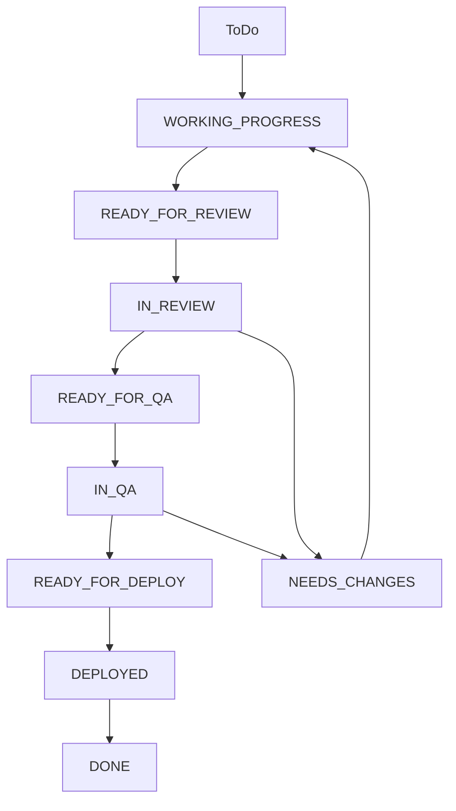

# 🔄 Workflow de Gestión de Tickets con IA

## 📋 Visión General

Este documento define el proceso completo para trabajar con tickets utilizando IA, desde la creación hasta la implementación y revisión.

## 🎯 Objetivos

1. **Estandarizar** el proceso de creación y gestión de tickets
2. **Optimizar** la colaboración entre humanos e IA
3. **Garantizar** calidad y consistencia en las implementaciones
4. **Documentar** decisiones y cambios realizados

---

## 📝 Fase 1: Creación de Tickets (Humano + IA Colaborativa)

### 1.1 Consultar Workflow
```bash
# Revisar este documento antes de iniciar
cat .tickets/WORKFLOW.md
```

### 1.2 Consultar Template
```bash
# Usar el template base
cp .tickets/TEMPLATE-TICKET.md .tickets/[PROYECTO-XXX].md
```

### 1.3 Crear Ticket Base
**🤖 IA Rol**: Asistente de Product Manager
**📋 Tareas**:
- Crear ticket con datos básicos usando el template
- Completar información general (ID, tipo, prioridad)
- Agregar contexto inicial basado en la solicitud

**📝 Input Requerido**:
```markdown
Solicitud: [Descripción breve del requerimiento]
Módulo: [AUTH/PLATFORM/USER/API/etc.]
Prioridad: [Baja/Media/Alta/Crítica]
```

### 1.4 Sesión de Requerimientos
**🤖 IA Rol**: Business Analyst + Technical Lead
**🔄 Proceso Iterativo**:

#### Iteración 1: Contexto de Negocio
**Preguntas IA**:
- ¿Cuál es el problema específico que estamos resolviendo?
- ¿Quién es el usuario objetivo?
- ¿Cómo se mide el éxito?
- ¿Cuál es la urgencia/timeline?

#### Iteración 2: Especificaciones Funcionales
**Preguntas IA**:
- ¿Cuál es el flujo de usuario ideal?
- ¿Hay restricciones o reglas de negocio?
- ¿Qué integraciones se requieren?
- ¿Hay consideraciones de UI/UX?

#### Iteración 3: Especificaciones Técnicas
**Preguntas IA**:
- ¿Qué componentes del sistema se afectan?
- ¿Se requieren nuevos endpoints o modificaciones?
- ¿Hay cambios en la base de datos?
- ¿Qué consideraciones de seguridad aplican?

#### Iteración 4: Criterios de Aceptación
**Preguntas IA**:
- ¿Cuáles son los criterios de éxito funcionales?
- ¿Hay requerimientos de performance?
- ¿Qué pruebas específicas se necesitan?

### 1.5 Validación Final
**✅ Checklist antes de pasar a implementación**:
- [ ] Todos los campos del template están completos
- [ ] Criterios de aceptación son específicos y testeable
- [ ] Componentes técnicos están identificados
- [ ] Dependencias están documentadas
- [ ] Cliente ha revisado y aprobado el ticket

---

## ⚙️ Fase 2: Implementación (IA Developer)

### 2.1 Inicio de Trabajo
**🤖 IA Rol**: Senior Developer
**📋 Acción**:
```markdown
Estado: ToDo → WORKING_PROGRESS
Asignado: IA Developer
Fecha Inicio: [YYYY-MM-DD HH:MM]
```

### 2.2 Consulta de Documentación
**📚 Fuentes de Información**:
```bash
# Documentación principal
.github/
├── ARCHITECTURE.md          # Arquitectura del sistema
├── CODING_STANDARDS.md      # Estándares de código
├── API_GUIDELINES.md        # Guías de API
├── SECURITY_GUIDELINES.md   # Consideraciones de seguridad
├── TESTING_STRATEGY.md      # Estrategia de testing
└── DEPLOYMENT_PROCESS.md    # Proceso de deployment
```

**🔍 Validaciones**:
- [ ] Revisar arquitectura actual del módulo
- [ ] Consultar estándares de código aplicables
- [ ] Verificar patrones de API existentes
- [ ] Revisar consideraciones de seguridad
- [ ] Consultar estrategia de testing

### 2.3 Análisis y Approach
**📋 Deliverable**: Documento de Approach
```markdown
## 🎯 Approach Técnico - [PROYECTO-XXX]

### Análisis de Impacto
- Componentes afectados: [lista]
- Dependencias identificadas: [lista]
- Riesgos técnicos: [lista]

### Opciones de Implementación

#### Opción 1: [Nombre del Approach]
**Pros**: [lista]
**Contras**: [lista]
**Esfuerzo**: [estimación]

#### Opción 2: [Nombre del Approach]
**Pros**: [lista]
**Contras**: [lista]
**Esfuerzo**: [estimación]

### Recomendación
**Approach Seleccionado**: [Opción X]
**Justificación**: [razones]

### Plan de Implementación
1. [Paso 1]
2. [Paso 2]
3. [Paso 3]
```

### 2.4 Implementación
**🔄 Proceso Iterativo**:

#### Iteración 1: Cambios Core
- Implementar lógica principal
- Validar funcionamiento básico
- Ejecutar tests unitarios

#### Iteración 2: Integración
- Implementar integraciones necesarias
- Validar flujo completo
- Ejecutar tests de integración

#### Iteración 3: Refinamiento
- Optimizar performance
- Agregar logs y monitoreo
- Validar criterios de aceptación

### 2.5 Validación Continua
**🧪 Testing en cada iteración**:
```bash
# Tests unitarios
pytest tests/unit/

# Tests de integración
pytest tests/integration/

# Linting y formato
black . && flake8 .

# Seguridad
bandit -r .
```

### 2.6 Finalización
**📋 Documentar Resolución**:
```markdown
## 🎯 Resolución del Ticket - [PROYECTO-XXX]

### Cambios Implementados
#### Backend
- [Archivo modificado 1]: [Descripción de cambios]
- [Archivo modificado 2]: [Descripción de cambios]
- [Archivo nuevo 3]: [Descripción de funcionalidad]

#### Base de Datos
- [Migración aplicada]: [Descripción]
- [Tabla/campo nuevo]: [Propósito]

#### Tests
- [Test unitario 1]: [Cobertura]
- [Test integración 2]: [Escenario validado]

### Decisiones Técnicas
- **[Decisión 1]**: [Justificación]
- **[Decisión 2]**: [Justificación]

### Performance
- [Endpoint]: [Tiempo respuesta]
- [Query DB]: [Tiempo ejecución]

### Consideraciones de Seguridad
- [Medida 1]: [Implementación]
- [Medida 2]: [Implementación]

### Próximos Pasos
- [ ] Deploy en staging
- [ ] Validación de QA
- [ ] Deploy en producción

---
**Completado por**: IA Developer
**Fecha**: [YYYY-MM-DD HH:MM]
**Tiempo total**: [X horas]
```

**📋 Cambio de Estado**:
```markdown
Estado: WORKING_PROGRESS → READY_FOR_REVIEW
```

### 2.7 Ticket Frontend/Mobile
**📱 Generación Automática**:
```markdown
# [PROYECTO-XXX]-MOBILE: [Funcionalidad relacionada]

## 📋 Información del Ticket
| Campo | Valor |
|-------|--------|
| **ID** | [PROYECTO-XXX]-MOBILE |
| **Tipo** | Feature |
| **Estado** | BACKLOG |
| **Relacionado con** | [PROYECTO-XXX] |

## 🎯 Descripción
Implementar en frontend/mobile los cambios realizados en [PROYECTO-XXX].

## 🔧 Cambios Requeridos
### Nuevos Endpoints Disponibles
[Lista de endpoints creados]

### Nuevos Campos/Modelos
[Lista de modelos actualizados]

### Flujo UI Sugerido
[Descripción del flujo]

## 📋 Criterios de Aceptación
- [ ] [Criterio 1]
- [ ] [Criterio 2]
- [ ] [Criterio 3]
```

---

## 📊 Estados de Tickets



## 🔧 Herramientas y Comandos

### Crear Nuevo Ticket
```bash
# Copiar template
cp .tickets/TEMPLATE-TICKET.md .tickets/AUTH-001.md

# Editar con IA
code .tickets/AUTH-001.md
```

### Cambiar Estado de Ticket
```bash
# Script para cambiar estado (futuro)
./scripts/ticket-status.sh AUTH-001 WORKING_PROGRESS
```

### Validar Ticket
```bash
# Validar que el ticket esté completo
./scripts/validate-ticket.sh AUTH-001
```

---

## 📚 Referencias

- **Template**: `.tickets/TEMPLATE-TICKET.md`
- **Documentación**: `.github/`
- **Ejemplos**: `.tickets/examples/`
- **Scripts**: `./scripts/`

---

**Documento creado**: 2025-07-16  
**Última actualización**: 2025-07-16  
**Versión**: 1.0
